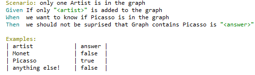
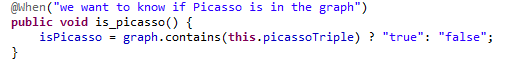

# **BDD tesztek**

A behavior-driven development tesztek elvégzéséhez a Cucumber eszközt használtam. A Cucumber egy speciális logikai nyelvet a Gherkint használja
ahhoz, hogy a program működését érthetővé tegye a programozói szakmán kívülálló érdekeltek számára. Gherkin szintakszis kulcsszavak segítségével meghatároz bizonyos viselkedéseket, teszt szituációkat melyek mögött automatikus teszt metódusok hívódnak meg.
A teszteket egy feature kiterjesztésű fájlban, ún. szcenáriókban valósítottam meg, melyek mögött a StepDefinitions.java fájlban található metódusok futnak le. Alább található egy egyszerű tesz szcenárió ahol egy bizonyos triplet szúrok be és megnézem, hogy benne van-e a gráfban. Láthatjuk, hogy a teszt leírás paraméterezve, így többféle inputtal is kipróbálhattam a teszteket, melyek az Examples-blokkban vannak felsorolva:

A sorok elején megadott Gherkin kulcsszavak mint „Given”, ”When” mögött a StepDefinitions fájlban található metódusokat asszociálja a teszt, mint például:

Látható tehát, hogy a  „we want to know if Picasso is in the graph” hétköznapi nyelven érthető akár nem technikai emberek számára, hogy fordul le kódra: a gráfban egy triple csomópont tartalmazás vizsgálatára

A lenti képen pedig, az is látszik, hogy a feature fájlból átadott paramétert, hogyan használom fel a teszt ellenörzésének szempontjából. Ennek segítségével tudok egy teszt szcenárióhoz akár több esetet viszgálni.

