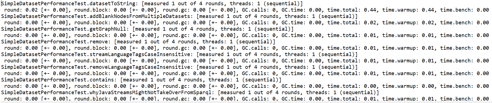
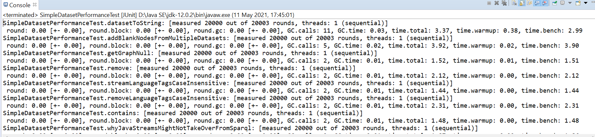
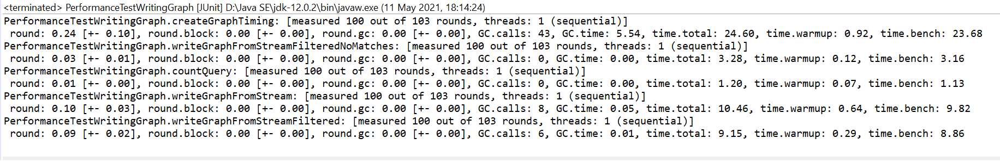

# **Teljesítmény**

A teljesítménytesztek elkészítéséhez a JUnitBenchmark eszközt választottam. 
A teljetítménytesztek megvalósításához létrehoztam a *simple* mappában az *src/test/java/performance_testing* packaget, ahova a teljesítménytesztek osztályai kerültek majd. Minden tesztosztályhoz elkészítettem egy teljesítménytesztosztályt. A teljesítménytesztekért felelős osztály leszármazottja a neki megfelelő tesztosztálynak, így nekem elég volt a teljesítménytesztelés paramétereit megadnom, a JUnitBenchmark automatikusan alkalmazza az összes publikus függvényre, így a megörökölt teszteket már a megfelelő benchmark paraméterekkel futtatja.

Ahogy az első képen is látszódik, ha például a SimpleDataset-hez tartozó teszteket lefuttatjuk, és lemérjük 1 futás idejét, akkor az elhanyagolható időbe telik (<0.01 másodperc).

Ha a lemért futások számát megemeljük, és mondjuk 20 000 alkalommal futtatjuk a teszteket egymás után, akkor a következő eredményt kapjuk:

Látható, hogy itt maga a mért teszt vette el a több időt, nem pedig a bemelegítés (warmup rounds), viszont itt sem volt túl sok, átlagosan körülbelül 2 másodperc alatt lefutott egy adott teszt 20 000-szer.

Míg a tesztek nagy részére igaz az, hogy nagy ismétlésszám mellett sem vesz igénybe sok időt, azért van pár kivétel.
Például a TestWritingGraph osztály tesztjeit nem is kell 20 000-szer futtatni ahhoz, hogy az eddigiekhez képest lassúnak tűnjön. Elég 100-szor ismételni, és a *creategraphTiming* teszt máris több mint 20 másodpercig futott, de több másik teszt is 8 másodperc feletti időt produkált.

A tesztelést csak egy szálon tudtam megvalósítani, mivel a könyvtár nem támogatja a többszálú hozzáférést, így többszálú futtatás esetén a tesztek hibára futottak.
