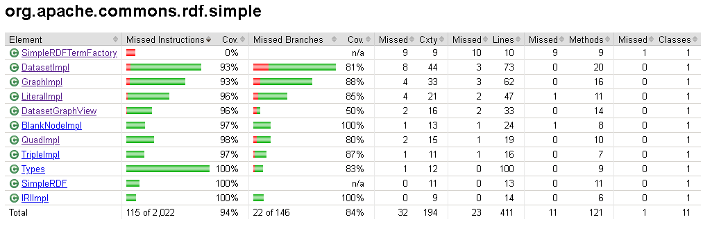

# Egységtesztek kiegészítése, kódfedettség mérése

## Kezdőállapot

A kiválasztott projekt már kiinduló állapotban rendelkezik egységtesztekkel. Feladatunkban a simple mappára fókuszálunk, amely a Commons RDF API egyszerű implementációja, a meglevő tesztek pedig ennek megfelelően sokszor az API tesztjeire épülnek, amik úgy vannak megírva, hogy minden implementáción lefussanak. 

A kódfedettség mérésére a JaCoCo-t fogjuk használni, amelyet gyakorlaton megismerhettünk.

A kódfedettség a munkánk kezdetekor már eleve 84%-os volt, tehát mondhatjuk, hogy elég jó, a missed branches ehhez képest arányaiban nagyobb, mindössze 71%-os a fedettsége.

## Fedettség növelése

### LiteralImpl

Ebben az osztályban azt teszteltük, hogy a konstruktorok dobnak-e kivételt, ebből az egyik exception-t nem tudtuk elérni, Objects.requireNonNull() miatt előbb kapunk NullPointerException-t.

### DatasetGraphView

Ennek az osztálynak sok függvénye nem volt meghívva eredetileg, ezekhez új teszteket hoztam létre. Ezek a tesztek eléggé magától értetődőek (hármas hozzáadása és eltávolítása, egyben valamint külön, stb), ezért nem részletezném őket.

### GraphImpl és DatasetImpl

A két osztályban hasonló kódrészletek nem voltak lefedve, így ezeket hasonló tesztekkel bővítettem. Itt most a DatasetImpl osztályból csatolok képeket.

#### internallyMap

Mint látható, ezeknek függvényeknek nagy része nem futott le:

A tesztek kiegészítésével ezt nagyrészt javítottuk is, de például a kivétel dobását itt sem sikerült elérnünk:

#### toString()

A függvényben lévő feltétel szerint, ha a dataset-ben 10-nél több négyes szerepel, akkor az első 10-et kiírja, valamint hogy mennyi van benne, és azt, hogy hány van ezen felül, de ez nem lett futtatva.

## Végső állapot

Így tehát a meglévő tesztek kiegészítésével és néhány új tesztesettel sikerült a kódfedettséget további 10%-al növelni, valamint a kihagyott elágazásokat is közel felére csökkentettük, ezzel azok fedettsége is 11%-al nőtt.